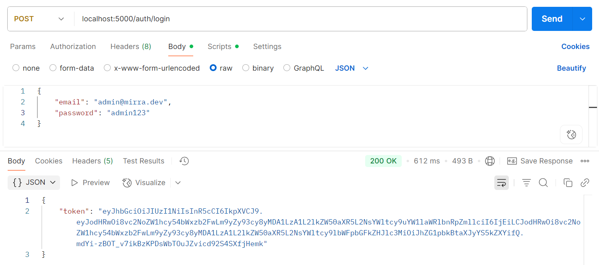
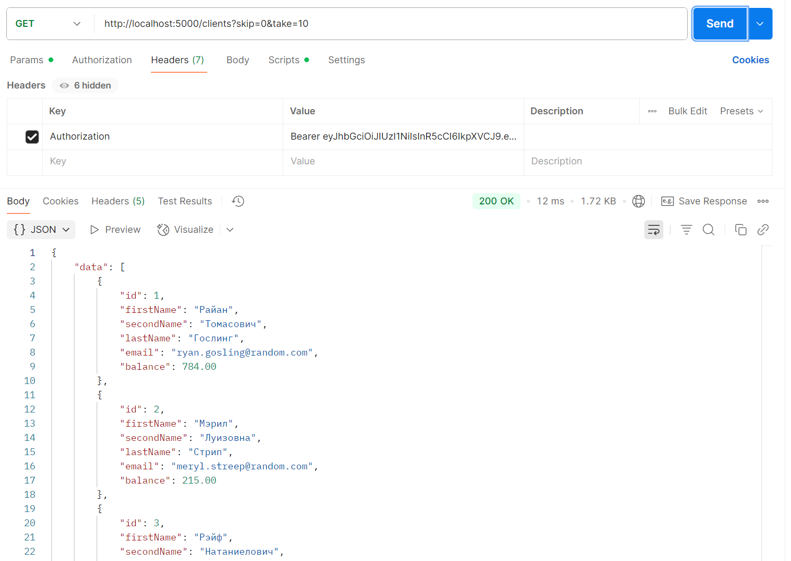

# Админ.панель для управления клиентами

Данный репозиторий содержит готовую сборку для запуска в Docker админ.панели, работающей на "локалхостах".

### Инструкция для запуска:

1. Скачать папку `mira-docker` этого репозитория.
2. В терминале Linux перейти через команду `cd` внутрь папки `mira-docker`.
3. Запустить сборку и дождаться её завершения: `docker-compose up --build -d`
4. Зайти в браузер, перейти на страницу: http://localhost:5173/login
5. Ввести логин: `admin@mirra.dev`, пароль `admin123`.
6. Случится:

## Описание сборки

### Backend:
Cобранное веб-приложение на C# по созданию, наполнению первоначальными данными, управление базой данных на PostgreSQL. Взаимодействие с базой, миграции идут посредством работы EF. Приложение предоставляет публичные эндпоинты для авторизации и приватные для получения данных. Работает по порту http://localhost:5000.

Репозиторий разработки, с первичными файлами, отдельный, доступен по ссылке:
https://github.com/AndySteelrail/mira_dev_backend/tree/main/Mira

### Frontend:
Cобранное веб-приложение на Vite+TS+React+MUI представляющее собой 2 страницы:
* http://localhost:5173/login (на эту страницу идёт редирект с http://localhost:5173, либо с других страниц порта в отстутствие авторизации)
* http://localhost:5173/dashboard (сама админ.панель)

Репозиторий разработки, с первичными файлами, отдельный, доступен по ссылке:  
https://github.com/AndySteelrail/mira_dev_frontend

##

В проекте реализована JWT-авторизация, UI, CRUD'ы для клиентов, просмотр истории платежей, управление курсом токена. Есть поиск и фильтрация, которые работают через параметризованные запросы к API.

Стиль frontend-приложения вдохновлён сайтом авторов тестового задания, чьей реализацией является этот репозиторий. Ссылка на сайт:
https://club-gamedev.com/

Добавил margin'а, padding'а, gosling'а.

### Иллюстрация работы:

Для иллюстрации запросов ослаблены настройки CORS (в обычном режиме, backend "слушает" только frontend)
1. Запрос на авторизацию - токен в ответ:

2. Он же, через curl:

3. Запрос данных, уже с применением токена:

### Комментарии и допущения:

1. Авторизация: не вешал дополнительных параметров авторизации, есть только потребность в токене. JWT ранее не реализовывал, сделал минимально работающий вариант по советам DeepSeek'а. Реализацию можно улучшить по безопасности и расширить. В docker-compose ключ уже передан отдельной строкой.
2. Токен хранится в appsettings.json в дев.билде.
3. Frontend хранит сертификаты для запуска на https - при минимальной перенастройке ссылок, сервисы могут работать на https. На Windows так и работал. Для простоты работы в Docker, перевёл на http.  
4. API относительно задания разумно расширены.
5. Архитектура фронтенда весьма спорна. С TS и React'ом я только начинаю работать - делал небольшие проекты ранее. С библиотекой MUI немного познакомился, делая другое тестовое. Постарался стили вынести в отдельные CSS, а не хранить в пропсах. Фронт, конечно же, очень сильно собран нейронкой. После чего, в меру декомпозирован.
